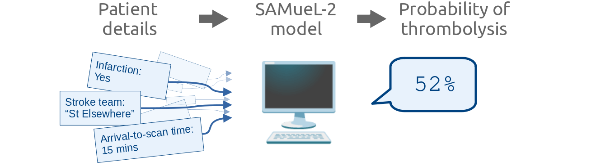

# Thrombolysis decisions 

This repository contains the code behind the Streamlit app for the SAMueL-2 machine learning model for predicting thrombolysis use:

The model is described in the [online SAMuEL book](https://samuel-book.github.io/samuel-2/samuel_shap_paper_1/introduction/intro.html).

The app takes user inputs to select the details of an imaginary patient being admitted for emergency stroke, and these are used to calculate the probability of that patient receiving thrombolysis in each of 132 stroke teams.

## Layout of the code

The `.py` file behind each page is kept as short as possible so that it is easier to change the layout of the displayed page.

Generally the necessary calculations are stored in functions in `utilities_ml/main_calculations.py`, and most of the formatting and displaying of objects is in the "container" scripts e.g. `utilities_ml/container_X.py` (named for [Streamlit's way of grouping objects](https://docs.streamlit.io/library/api-reference/layout/st.container) but actually just `.py` scripts with all of the code needed to populate that chunk of the page).

### Which scripts do you need?

If you want to use the models but aren't interested in the Streamlit parts, you will need the following.

To work out how to piece it all together, it might be helpful to look at the "Setup" and "Calculations" sections of `Interactive_demo.py`. A number of useful functions are stored in `utilities_ml/main_calculations.py`.

__Models__:
+ `data_ml/model.p` - Prediction model.
+ `data_ml/shap_explainer.p` - SHAP explainer model in terms of log-odds.
+ `data_ml/shap_explainer_probability.p` - SHAP explainer model in terms of probability.

These three `.p` models have been pickled. There are functions for unpickling them in `utilities_ml/inputs.py`.

__Data__:
+ `data_ml/stroke_teams.csv` - A list of stroke team names, sorted alphabetically.
+ `data_ml/hospital_10k_thrombolysis.csv` - A list of stroke team names and their thrombolysis rate across the 10k cohort, sorted by decreasing thrombolysis rate. The 30 teams with the highest rates here are labelled as benchmark teams in the app.

The remaining file in `data_ml`, `synthetic_10_features.csv`, is an example of the patient data that is passed to the models in order to predict the thrombolysis rates.

### Pages 

The Streamlit landing page is `1: Introduction.py`. In the sidebar there are a series of other pages to choose, and these are stored in the `pages/` directory:

+ `2: Interactive_demo.py` - the main page. The user can select the patient details and receive their probability of thrombolysis at 132 stroke hospitals, and see a breakdown of the model decisions.
+ `3: Advanced_options.py` - currently empty.
+ `4: Project.py` - information about the project and people behind this project.
+ `5: Cite_this_work.py` - Zenodo citation. 
+ `6: Resources.py` - links to further useful materials. 

The page topics follow the recommendations of Tom Monks and Alison Harper (in Proceedings of the Operational Research Society Simulation Workshop 2023 (SW23)). 

When these pages display a large amount of markdown text in one go, that text is imported from a `.txt` file in `pages/text_for_pages/` to prevent constant re-spacing to keep the lines below 79 characters. 